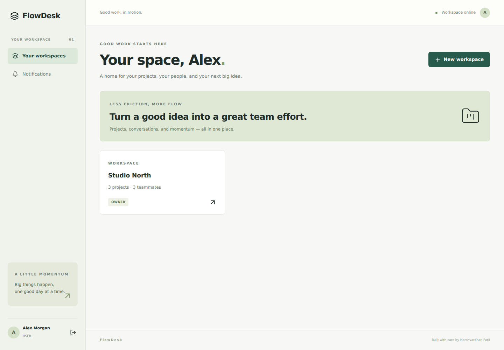
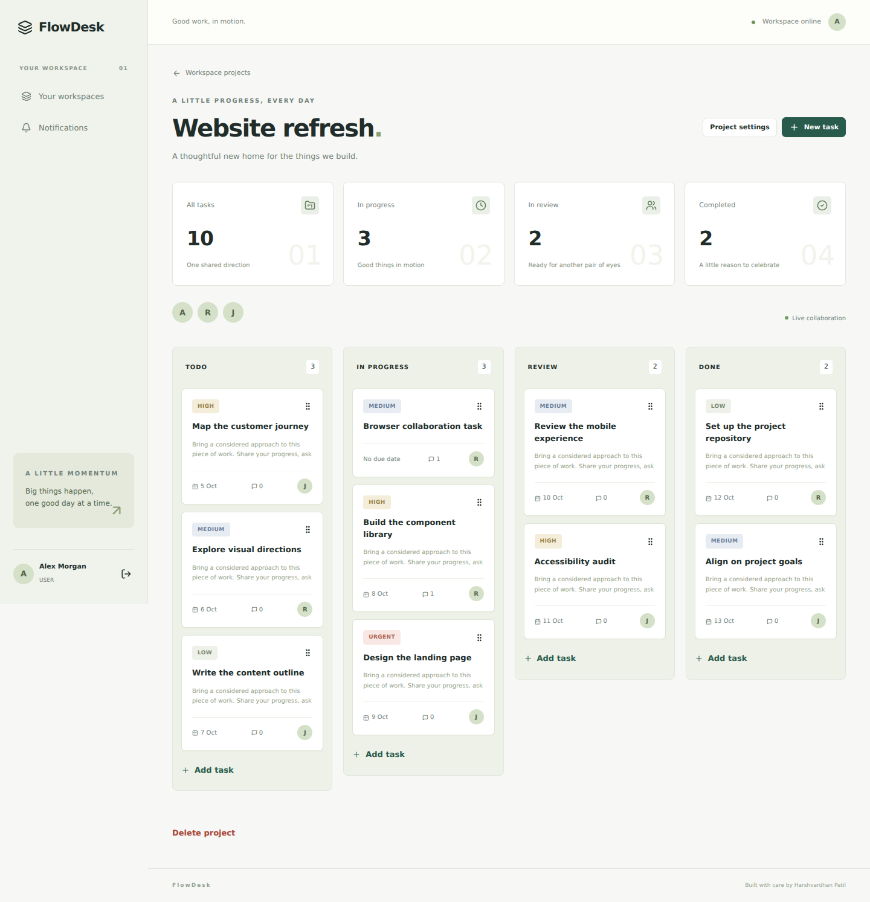

# FlowDesk

**A real-time project workspace** · Built by [Harshvardhan Patil](https://github.com/harsh200539)

Workspace-isolated project management with optimistic Kanban moves, live events and version-based conflict detection.

## Features

- Workspace OWNER / ADMIN / MEMBER roles, checked on every request.
- Workspace creation, registered-member invites, role changes and removal.
- Projects with admin create/edit/delete and member collaboration.
- Task CRUD, priority, assignees, due dates, Kanban drag handles and accessible stage dropdowns.
- Comments, task history, assignment notifications and read status.
- Authenticated Socket.IO rooms and mutations; member checks before each broadcast.
- Optimistic task moves, rollback on failure, stale-version conflicts and reconnect refetching.

## Screenshots





## Tech stack

React 19, TypeScript, Vite, Tailwind CSS 4, React Router, TanStack Query, Axios and Lucide. Express 5, TypeScript, Prisma 6, PostgreSQL, Zod, bcrypt and JWT. Vitest, React Testing Library and Supertest. Docker Compose and GitHub Actions.

Socket.IO and dnd-kit.

## Architecture and database

The React client calls the Express API. Prisma reads/writes PostgreSQL; authorization is enforced before accessing each resource. The client uses an HTTP-only session cookie and caches API results with TanStack Query. See [`schema.prisma`](server/prisma/schema.prisma) and committed SQL migrations.

User ↔ Workspace through Membership; Workspace → Project → Task; Task → Comment / Activity; User → Notification.

- `client/src/App.tsx`: domain pages and flows.
- `client/src/shared.tsx`: session, protected routes, data hooks, dialogs and form controls.
- `server/src/auth.ts`: authentication and administrative user provisioning.
- `server/src/routes.ts`: validated, authorized REST endpoints.
- `server/src/lib.ts`: errors, identity checks, pagination and transaction retries.
- `server/prisma/seed.ts`: repeatable fictional demo data.
- `server/test/integration.test.ts`: security/business integration tests.

## Installation and running locally

Requires Node.js 22+ and PostgreSQL 16+ (or Docker).

```bash
npm ci
cp server/.env.example server/.env
# Edit server/.env with DATABASE_URL, a random JWT_SECRET, and SEED_PASSWORD.
npm run db:generate -w server
npm run db:migrate
npm run db:seed
npm run dev
```

On Windows, use `Copy-Item server/.env.example server/.env` instead of `cp`. Create the `flowdesk` database before applying migrations. The API loads `server/.env` because workspace scripts run from the server directory. Vite proxies `/api` and `/socket.io` locally.

Frontend: `http://localhost:6003` · API: `http://localhost:5003/api`.

Use `owner@flowdesk.demo, member@flowdesk.demo, designer@flowdesk.demo` with the password set in `SEED_PASSWORD`. Seeds do not reset existing passwords on repeated runs. Set a real random secret; environment files are ignored by Git.

## Docker

```bash
# Put a random JWT_SECRET in your shell or an ignored root .env file.
# Example: node -e "console.log(require('crypto').randomBytes(48).toString('hex'))"
docker compose up --build -d
docker compose exec server npm run db:seed -w server
```

Open `http://localhost:8080`. PostgreSQL and uploads use named volumes. To run all repositories simultaneously, assign separate `DB_PORT`, `WEB_PORT` and `API_PORT` values in each root `.env`.

## API documentation

Import [`docs/FlowDesk.postman_collection.json`](docs/FlowDesk.postman_collection.json) into Postman. Update `baseUrl`, record IDs and sample data. Login stores an HTTP-only cookie; Postman reuses the cookie jar. Every non-webhook write needs `X-App-Request: 1`. JSON validation failures return 400, unauthenticated requests 401, forbidden actions 403, scoped missing records 404, and business conflicts 409.

[`docs/API.md`](docs/API.md) lists all implemented endpoints. Lists use `page` and `limit` (1–100); related details return scoped child records. Some small lookup lists have a fixed 100-record cap.

## Authentication and security

- bcrypt password hashes; passwords are 10–72 characters.
- HS256 JWT expires in 8 hours and lives in an HTTP-only cookie.
- Logout and role changes increment the session version, revoking prior JWTs.
- Registration cannot choose elevated roles; the backend reloads the current role.
- Strict Zod write schemas, scoped authorization and bounded pagination.
- Helmet, rate limits, explicit credentialed CORS and a custom write header for CSRF protection.
- Responses exclude password hashes; secrets never enter the React bundle.

For production, set `COOKIE_SECURE=true`. If frontend/API are on unrelated domains, also set `COOKIE_SAME_SITE=none`; use an exact HTTPS `CLIENT_URL`. A same-site custom-domain setup avoids browser third-party-cookie restrictions. Configure trusted proxy handling explicitly for your host rather than blindly trusting forwarded headers.

## Business rules

Workspace membership is the authorization boundary; global USER/ADMIN fields do not grant access to other workspaces. Workspace owners appoint administrators. Members collaborate on tasks but cannot create/delete projects or manage members. Invitations add an already registered email; outbound email invitations are not included.

HTTP and Socket.IO task mutations share the same services. Socket handshakes verify JWT identity; `join_project` checks membership. Each mutation and broadcast checks identity and membership again. Removing a member clears their task assignments and evicts their project rooms. Task version updates reject stale edits with 409 rather than silently overwriting another user's change.

The database is the source of truth. Events emit after committed mutations; clients refetch on reconnect. Moving tasks is optimistic and rolls back on failure. Drag handles and status dropdowns support different input needs. The current board displays up to 100 tasks; the API supports pagination for larger workspaces. A durable event outbox and a Redis adapter for multi-instance delivery are future extensions; this implementation runs one Socket.IO API instance.

## Testing

```bash
# Use a dedicated, migrated test PostgreSQL database in DATABASE_URL.
npm test
# Or run SQL integration tests without a PostgreSQL server:
npm run test:embedded
npm run build
```

19 tests cover authentication/forms and domain behavior. CI provisions native PostgreSQL, applies migrations, builds both applications and runs the suites. Local verification also ran the integration suite through an embedded PostgreSQL engine adapter; this does not substitute for multi-process load tests. Tests create uniquely named fixtures and remove their own records.

## Environment variables

Copy the supplied example files. Server: `DATABASE_URL`, `JWT_SECRET`, `PORT`, `CLIENT_URL`, `COOKIE_SECURE`, `COOKIE_SAME_SITE`, `SEED_PASSWORD`. Client: `VITE_API_URL` (defaults to `/api`).

FlowDesk adds `VITE_SOCKET_URL` for a separately hosted API.

## Deployment

The source is ready for separate frontend/API deployment; publishing the repository does not deploy the application.

1. Deploy `client/` to Vercel. Install from the repository workspace root and build with `npm run build -w client`; output is `client/dist`. Set `VITE_API_URL` to the API's HTTPS `/api` URL.
2. Deploy the Express API to a Node/Docker host and provision PostgreSQL. Set server variables, generate Prisma, build, apply migrations and start the API. Backend start from repository root: `npm start -w server`.
3. Set an exact frontend `CLIENT_URL` and secure cookie settings. Bootstrap demo accounts only in a demonstration environment. Do not assume a host's free tier supports persistent files or always-on processes.
4. Enable WebSocket upgrades and set `VITE_SOCKET_URL`. A long-lived Socket.IO server belongs on the API host, not a Vercel function.

## Future improvements

Email verification/password recovery, a refresh-token rotation flow, expanded audit retention and end-to-end load testing. Task ordering within columns, virtualized large boards, durable event outbox and Redis coordination.
